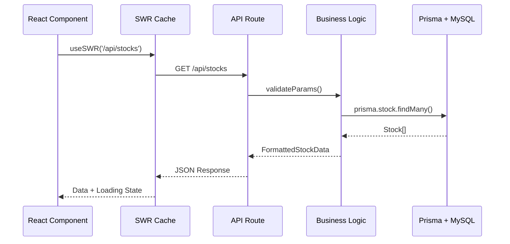
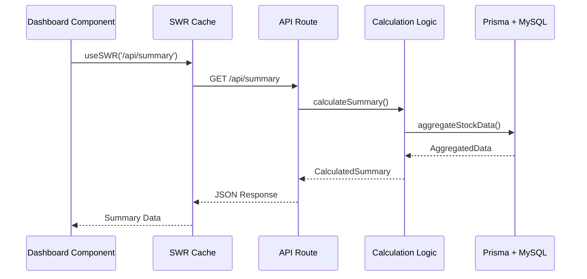
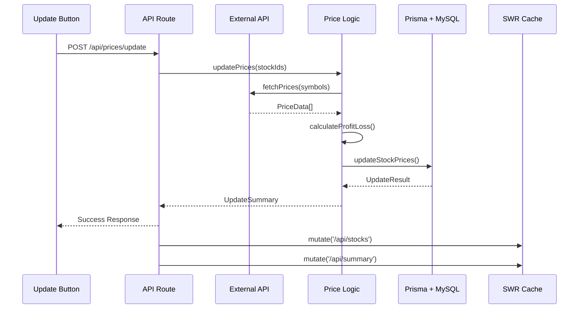
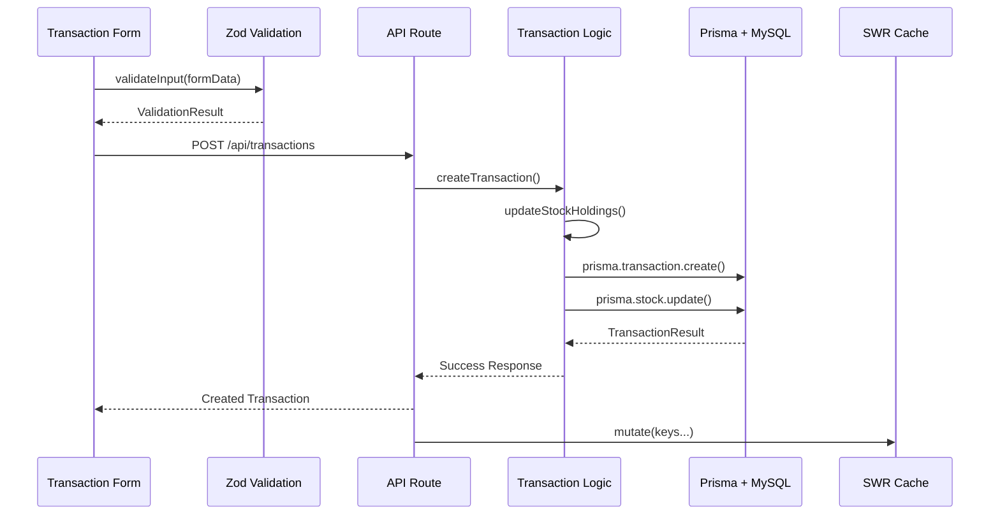
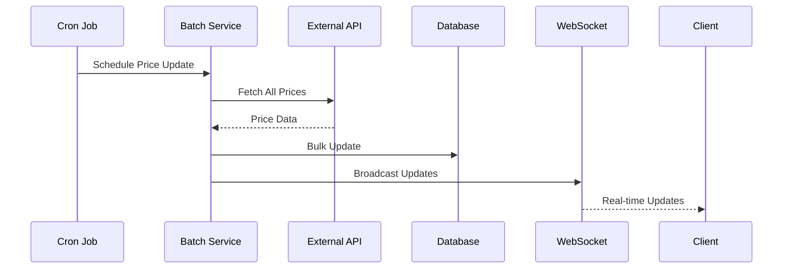

# データフロー設計

## 参照元要件
- [銘柄一覧機能要件](../1-requirements/stock-management.md)
- [ポートフォリオサマリー機能要件](../1-requirements/portfolio-summary.md)
- [株価自動取得機能要件](../1-requirements/price-update.md)
- [ドメインモデル概要](../2-domain/0-overview.md)

## アーキテクチャ概要

### レイヤー構成
```
┌─────────────────────────────────────────┐
│           Presentation Layer            │
│  (React Components + Tailwind CSS)     │
├─────────────────────────────────────────┤
│            Service Layer                │
│       (SWR + Custom Hooks)             │
├─────────────────────────────────────────┤
│              API Layer                  │
│        (Next.js API Routes)            │
├─────────────────────────────────────────┤
│           Business Layer                │
│      (Domain Logic + Validation)       │
├─────────────────────────────────────────┤
│           Data Access Layer             │
│          (Prisma ORM)                  │
├─────────────────────────────────────────┤
│           Database Layer                │
│            (MySQL 8.0)                 │
└─────────────────────────────────────────┘
```

## データフロー詳細

### 1. 画面表示フロー

#### 銘柄一覧表示


#### ポートフォリオサマリー表示


### 2. データ更新フロー

#### 株価手動更新


#### 取引データ追加


## キャッシュ戦略

### SWRキャッシュ設定
```typescript
// グローバル設定
const swrConfig = {
  refreshInterval: 5 * 60 * 1000, // 5分間隔
  revalidateOnFocus: true,
  revalidateOnReconnect: true,
  errorRetryCount: 3,
  errorRetryInterval: 5000
}

// キー別設定
const cacheConfig = {
  '/api/stocks': { refreshInterval: 30000 }, // 30秒
  '/api/summary': { refreshInterval: 60000 }, // 1分
  '/api/transactions': { refreshInterval: 0 }, // 手動更新のみ
  '/api/portfolio/composition': { refreshInterval: 300000 } // 5分
}
```

### データ無効化戦略
```typescript
// 価格更新時
mutate(['/api/stocks', '/api/summary', '/api/portfolio/composition'])

// 取引追加時
mutate(['/api/stocks', '/api/transactions', '/api/summary'])

// 銘柄編集時
mutate(['/api/stocks', '/api/summary'])
```

## エラーハンドリング

### APIエラー対応
```typescript
// API Route エラー処理
export default async function handler(req: NextApiRequest, res: NextApiResponse) {
  try {
    // ビジネスロジック実行
  } catch (error) {
    if (error instanceof ValidationError) {
      return res.status(400).json({ error: error.message })
    }
    if (error instanceof DatabaseError) {
      return res.status(500).json({ error: 'Database error occurred' })
    }
    return res.status(500).json({ error: 'Internal server error' })
  }
}
```

### フロントエンドエラー対応
```typescript
// SWRエラーハンドリング
const { data, error, isLoading } = useSWR('/api/stocks', fetcher, {
  onError: (error) => {
    console.error('API Error:', error)
    toast.error('データの取得に失敗しました')
  },
  onErrorRetry: (error, key, config, revalidate, { retryCount }) => {
    if (retryCount >= 3) return
    if (error.status === 404) return
    setTimeout(() => revalidate({ retryCount }), 5000)
  }
})
```

## パフォーマンス最適化

### データベースクエリ最適化
```sql
-- インデックス設計
CREATE INDEX idx_stock_holding_company ON stocks(holding_company);
CREATE INDEX idx_stock_market ON stocks(market);
CREATE INDEX idx_transaction_stock_date ON transactions(stock_id, transaction_date);
CREATE INDEX idx_price_history_stock_recorded ON price_history(stock_id, recorded_at);

-- 効率的な集計クエリ
SELECT 
  holding_company,
  SUM(investment_amount) as total_investment,
  SUM(profit_loss) as total_profit_loss
FROM stocks 
WHERE shares_held > 0
GROUP BY holding_company;
```

### フロントエンド最適化
```typescript
// 仮想化による大量データ対応
import { FixedSizeList as List } from 'react-window'

// メモ化による再レンダリング防止
const StockRow = React.memo(({ stock }: { stock: Stock }) => {
  return <tr>...</tr>
})

// 遅延ローディング
const Chart = React.lazy(() => import('./Chart'))
```

## リアルタイム更新

### WebSocket（将来実装）
```typescript
// 価格更新のリアルタイム配信
const useRealtimePrices = () => {
  useEffect(() => {
    const ws = new WebSocket('/api/websocket/prices')
    
    ws.onmessage = (event) => {
      const { stockId, newPrice } = JSON.parse(event.data)
      mutate(
        key => typeof key === 'string' && key.startsWith('/api/stocks'),
        undefined,
        { revalidate: false }
      )
    }
    
    return () => ws.close()
  }, [])
}
```

### バッチ処理フロー


## セキュリティ考慮

### API認証フロー
```typescript
// JWT認証ミドルウェア
export const authenticate = async (req: NextApiRequest) => {
  const token = req.headers.authorization?.replace('Bearer ', '')
  if (!token) throw new UnauthorizedError()
  
  const payload = await jwt.verify(token, process.env.JWT_SECRET!)
  return payload.userId
}

// 認証が必要なAPIでの使用
export default async function handler(req: NextApiRequest, res: NextApiResponse) {
  const userId = await authenticate(req)
  // ユーザーデータのみアクセス
}
```

### データ検証フロー
```typescript
// Zodスキーマ定義
const StockCreateSchema = z.object({
  stockName: z.string().min(1).max(100),
  code: z.string().regex(/^[A-Z0-9]+$/),
  sharesHeld: z.number().min(0),
  avgAcquisitionPrice: z.number().min(0)
})

// API でのバリデーション
const validatedData = StockCreateSchema.parse(req.body)
```